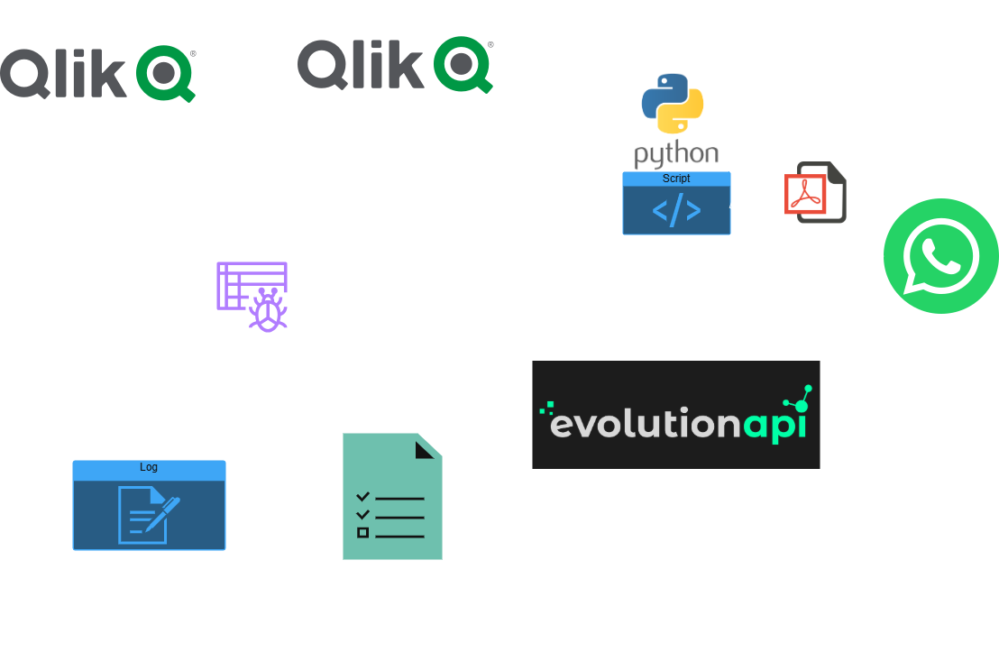

# WebScrepStatusQlik
Crawler e WebScraping automatizado para monitoramento e envio de status de tarefas do Qlik Sense (QMC e NPrinting), com suporte a envio de relatórios por WhatsApp via EvolutionAPI.

## 📌 Funcionalidades
Extrai status de tarefas do Qlik Sense QAP, HUB - QMCs.

Coleta e monitora logs de execução do NPrinting.

Gera relatórios em HTML e envia automaticamente.

Suporte a envio via Evolution API para número individual, grupo ou múltiplos destinos.

## 🧰 Extensões Recomendadas (VSCode)
``` bash
ms-python.vscode-python-envs
```

## ✅ Requisitos
- Python 3.10+
- Git
- Google Chrome instalado
- ChromeDriver compatível com a versão do seu navegador

## ⚙️ Dependências do Sistema
Para usuários Windows:
Baixe o Build Tools para compilar pacotes Python com dependências nativas:
https://visualstudio.microsoft.com/visual-cpp-build-tools/
Clique em “Download Build Tools”.
Na instalação, selecione “C++ build tools”.
Marque também a opção “Windows 10 SDK” ou “Windows 11 SDK”, conforme seu sistema.

## 🚀 Instalação

```bash
git clone https://github.com/wagnerhelio/WebScrepStatusQlik.git

```

```bash
cd WebScrepStatusQlik
```

```bash
python -m venv venv
```

Para usuários Windows:
```bash
Set-ExecutionPolicy -ExecutionPolicy RemoteSigned -Scope Process
```

```bash
.\.venv\Scripts\Activate # Para Windows
.\venv\Scripts\Activate  # Para Windows
source venv/bin/activate  # Para Linux/macOS
```

```bash
pip install -r requirements.txt
```

## ⚙️ Dependências do Sistema
Renomeie o arquivo .env_exemple para .env e preencha os dados de exemplo.
```bash
QLIK_USUARIO=dominio\\usuario
QLIK_EMAIL=bi@sspj.go.gov.br
QLIK_SENHA=suasenha123

CHROMEDRIVER=C:\Users\wagne\Documents\GitHub\WebScrepStatusQlik\chromedriver\chromedriver.exe

QLIK_QMC_QAP=https://URLQLIK/qmc
QLIK_TASK_QAP=https://URLQLIK/qmc/tasks

QLIK_QMC_HUB=https://URLQLIK/qmc
QLIK_TASK_HUB=https://URLQLIK/qmc/tasks

QLIK_NPRINT=https://NPRINT
QLIK_NPRINT_TASK=https://NPRINT/#/tasks/executions

EVOLUTION_BASE_URL=http://localhost:8080
EVOLUTION_API_TOKEN=12345678910
EVOLUTION_INSTANCE_ID=63A52E59B7AE-4E9C-954F-94526ACDD71F
EVOLUTION_INSTANCE_NAME=teste
EVO_DESTINO=556290000000
EVO_DESTINO_GRUPO=NOME_DO_GRUPO
EVO_TASKS_QMC=tasks_qmc
EVO_ERRORLOG=errorlogs

EVO_TASKS_NPRINT=tasks_nprinting
EVO_ERRORLOG_NPRINT=errorlogs_nprinting
``` 

## 🧪 WebDriver do Chrome
Baixe o WebDriver compativel com seu Google Chrome:
https://edgedl.me.gvt1.com/edgedl/chrome/chrome-for-testing/137.0.7151.69/win64/chromedriver-win64.zip

Extraia e salve dentro da pasta /chromedriver.


## 🧾 Execução dos Scripts
🟡 Coletar Status do QMC (HUB E QAP)

```bash
python .\statusqlik_qmc.py 
``` 
🔵 Coletar Status do NPrinting
```bash
python .\statusqlik_nprinting.py 
``` 
🟢 Enviar logs via WhatsApp (número único)
```bash
python .\sendnumber_statusqlik_evolution.py 
``` 
🟢 Enviar logs via WhatsApp para grupos(grupo)
```bash
python .\sendgroup_statusqlik_evolution.py 
``` 
🟢 Enviar para múltiplos destinos (grupo e lista)
```bash
python .\send_statusqlik_evolution.py 
``` 

## 📤 Integração com Evolution API
Siga o guia oficial da Evolution API - Introdução e configure:
https://doc.evolution-api.com/v1/pt/get-started/introduction

- Instância local ou em nuvem

- Obtenha a API_KEY, INSTANCE_ID e INSTANCE_NAME

- Defina os destinos (número ou grupo com remoteJid)

## 🗂 Estrutura do Projeto
```bash
WEBSCREPSTATUSQLIK/
├── chromedriver/               # ChromeDriver compatível com sua versão
├── docker/                     # Arquivos para futura dockerização
├── errorlogs/                  # Logs de falhas coletados
├── img/                        # Imagens e diagramas
├── tasks_nprinting/            # Dados das tarefas NPrinting
├── tasks_qmc/                  # Dados das tarefas QMC
├── venv/                       # Ambiente virtual Python
├── .env                        # Variáveis de ambiente
├── .gitignore
├── README.md                   # Este arquivo
├── requirements.txt            # Dependências do projeto
├── scheduler_statusqlik.py     # Agendador de execução automática
├── send_statusqlik_evolution.py
├── sendgroup_statusqlik_evolution.py
├── sendnumber_statusqlik_evolution.py
├── statusqlik_nprinting.py     # Coleta de status do NPrinting
├── statusqlik_qmc.py           # Coleta de status do QMC
├── template.html               # Template para relatório geral
├── template_nprinting.html     # Template específico para NPrinting
``` 

## 🖼 Diagrama do Projeto



## 📬 Contato
Contribuições, sugestões e correções são bem-vindas!
Entre em contato wagner.helio@discente.ufg.br

## 📄 Licença
Este projeto é licenciado sob os termos da MIT License – veja o arquivo LICENSE para mais detalhes.

Você é livre para:

- Usar, copiar, modificar e redistribuir este software para qualquer finalidade, inclusive comercial;

- Incorporar este projeto em produtos próprios ou de terceiros.

Com a condição de manter os créditos ao(s) autor(es) original(is).

## 📚 Menção às Fontes e Créditos
- Este projeto foi desenvolvido com base em:

- Qlik Sense® – Ferramenta de Business Intelligence.

- Qlik NPrinting® – Módulo de geração e distribuição de relatórios do Qlik.

- Evolution API – Solução de integração com o WhatsApp via API.

- Selenium – Framework de automação de navegação web.

- pdfkit / WeasyPrint – Geração de PDF a partir de HTML.

- Inspiração na comunidade de desenvolvedores do GitHub, Stack Overflow e fóruns técnicos diversos.

